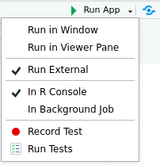

This is the readme for the DASB project of team 8: *Applications for asylum in Switzerland*.    

## Running the app
To run the app, follow the steps described below:

1. In R-Studio, open the file app.R.   
2. In the *Run App* drop down menu, select *Run external*. 
    * This ensures that the application is started in the browser.
    * If the application is not run in the browser, the *Download* functionality won't work.
       
    
## About data sources
* The data sources are stored in the folder *sources*.
* The steps that were taken to transform this data into the format used by app.R is described on the tab *Data and data cleaning*.

## About data quality assessment
For some of the source data, a quality assessment was performed using python in a jupyter notebook.  
            
* Both the jupypter notebooks and the associated html reports are stored in the folder *quality_assessment*. 
* To view the report, open the html file.

## About data preprocessing
Some of the preprocessing steps were performed using python scripts.
      
* The scripts are stored in the folder *scripts*, together with some of the data files used for transformation.
* The data ready to be used by the app.R file is stored in the *data* folder.
* The steps performed during preprocessing are described on the tab *Data and data cleaning*.

